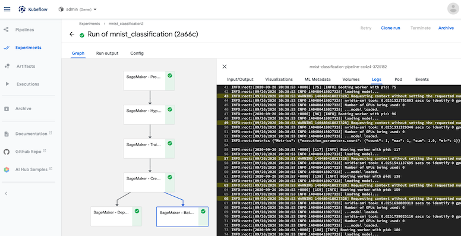
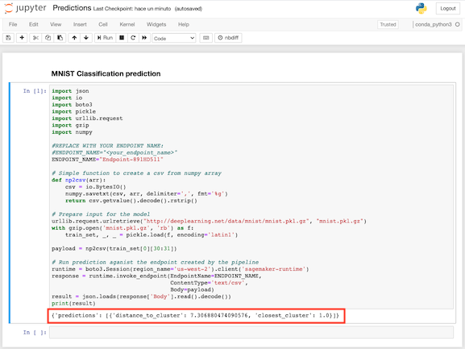

# ML hosting with Amazon SageMaker Components for Kubeflow Pipelines

For this workshop, we will use an Amazon EC2 instance as gateway for controlling our Kubeflow cluster in Amazon EKS. We will then work with a Jupyter notebook to setup some pipelines, exploring different machine learning inference options and model hosting features provided with Amazon SageMaker Components for Kubeflow Pipelines.

**Obectives:**
1. Explore how to setup Kubeflow Pipelines with Amazon EC2 and Amazon EKS, and configuring roles for interacting with Amazon SageMaker
2. Explore how to configure and use [Amazon SageMaker Components for Kubeflow Pipelines](https://docs.aws.amazon.com/sagemaker/latest/dg/amazon-sagemaker-components-for-kubeflow-pipelines.html)
3. Get experience defining ML pipelines in Kubeflow that rely on Amazon SageMaker for processing, hyper-parameter optimization, training, batch inferences, and online deployment of hosting endpoints
4. Explore other hosting features provided in Amazon SageMaker like Elastic Inference, Multi-Model Endpoints, or Model Monitoring

## Instructions

### Setup Kubeflow Pipelines and your AWS environment

1. Access your AWS Console with the URL provided, make sure you are in the region of Oregon (us-west-2). Look for the service Amazon EC2 and go to Instances. Create an EC2 instance with image “DeepLearning AMI (Linux)” and instance type “t3.medium”. Create a SSH key and save it in a safe location (we will need it later).
*Note we are using the DeepLearning AMI as it already comes with some packages that we would need later.*

2. Open a terminal in your PC and make sure you do "chmod 400 xxxx.pem" to your downloaded key from the previous step.

3. Wait for the instance to be ready in the EC2 Instances' console. SSH to the instance from the terminal in your PC with user "ec2-user", and the public IP of your instance (you can check this IP by going to "Connect" in the EC2 Instances' console), e.g.:
```
ssh -i "xxxxxx.pem" ec2-user@ec2-X-X-X-X.us-west-2.compute.amazonaws.com
```

4. Install kubectl from your terminal:
```
curl -LO "https://storage.googleapis.com/kubernetes-release/release/$(curl -s https://storage.googleapis.com/kubernetes-release/release/stable.txt)/bin/linux/amd64/kubectl"
chmod +x ./kubectl
sudo mv ./kubectl /usr/local/bin/kubectl
kubectl version --client
```

5. Now, install eksctl:
```
curl --silent --location "https://github.com/weaveworks/eksctl/releases/latest/download/eksctl_$(uname -s)_amd64.tar.gz" | tar xz -C /tmp
sudo mv /tmp/eksctl /usr/local/bin
curl -o aws-iam-authenticator https://amazon-eks.s3.us-west-2.amazonaws.com/1.17.9/2020-08-04/bin/linux/amd64/aws-iam-authenticator
chmod +x ./aws-iam-authenticator
mkdir -p $HOME/bin && cp ./aws-iam-authenticator $HOME/bin/aws-iam-authenticator && export PATH=$PATH:$HOME/bin
echo 'export PATH=$PATH:$HOME/bin' >> ~/.bashrc
aws-iam-authenticator help
```

6. Copy and paste your temporary credentials for being able to run the eksctl command in the next step, e.g.:
```
export AWS_DEFAULT_REGION=us-west-2
export AWS_ACCESS_KEY_ID=xxxxxxxxxxxxxx
export AWS_SECRET_ACCESS_KEY=xxxxxxxxxxxxxx
export AWS_SESSION_TOKEN=xxxxxxxxxxxxxx
```

7. Still from the SSH terminal, create an Amazon EKS cluster. We will use this cluster for running Kubeflow Pipelines:
```
eksctl create cluster \
--name kubeflow-sm \
--version 1.17 \
--region us-west-2 \
--nodegroup-name cpu-nodes \
--node-type c5.xlarge \
--nodes 2 \
--node-volume-size 50 \
--timeout=40m \
--auto-kubeconfig
```
*Note this step should take around 15 mins or so (do not close the SSH session in the meantime!). Once complete it should show "EKS cluster in region is ready".

8. Still from the SSH terminal, configure Kubeflow:

- a. Prepare the environment:
```
wget https://github.com/kubeflow/kfctl/releases/download/v1.1.0/kfctl_v1.1.0-0-g9a3621e_linux.tar.gz
tar -xvf kfctl_v1.1.0-0-g9a3621e_linux.tar.gz
export PATH=$PATH:/home/ec2-user
export CONFIG_URI="https://raw.githubusercontent.com/kubeflow/manifests/v1.1-branch/kfdef/kfctl_aws.v1.1.0.yaml"
export AWS_CLUSTER_NAME=kubeflow-sm
mkdir ${AWS_CLUSTER_NAME} && cd ${AWS_CLUSTER_NAME}
wget -O kfctl_aws.yaml $CONFIG_URI
```

- b. Go back to the AWS Console in your browser and go to Amazon SageMaker. Go to Notebook instances and “Create notebook instance”, put a Name, select “Notebook instance type” as “t3.medium”, expand the “Git repositories” menu and select “Clone a public Git repository” writing this URL: <>. Click “Create notebook instance”

- c. Configure Kubeflow: Again in your SSH terminal, make sure the cluster in step 7 is fully created before running this command:
```
aws eks update-kubeconfig --name 'kubeflow-sm' --region 'us-west-2'
export no_proxy=$no_proxy,.svc,.svc.cluster.local
export PATH=$PATH:/home/ec2-user
kfctl apply -V -f kfctl_aws.yaml
```
*Note you might see a warning for cert-manager, let it re-try until the warning clears.*

- d. Verify the installation:
```
kubectl get nodes    (check both ready)
kubectl -n kubeflow get all    (wait for Running)
kubectl get ingress -n istio-system    (provides the URL for accessing the KFP dashboard, access from your browser and setup the user) 
```

- f. Setup AWS IAM permissions for the Service Account: First get the OIDC...
```
eksctl utils associate-iam-oidc-provider --cluster kubeflow-sm --region us-west-2 --approve
aws eks describe-cluster --name kubeflow-sm --query "cluster.identity.oidc.issuer" --output text    (take note of the OIDC)
```

- g. Now go back to the AWS console and look for the service IAM. Go to "Roles" and click the role that was created for the node-group (it should be called like: "eksctl-kubeflow-sm-nodegroup-cpu-NodeInstanceRole-XXXXXXXXX"). Click "Attach policies" and select the "AmazonSageMakerFullAccess" policy, click on "Attach policy", repeat for the policy "AmazonS3FullAccess". Finally, click on "Trust relationship" and "Edit trust relationship", replace the current policy with the following and hit "Update trust policy". *Note normally we would use here the OIDC that we got from the Kubeflow installation above to make the permissions more restrictive, but for the purposes of this workshop we will work with the FullAccess policy. For more details on this check the [documentation here](https://docs.aws.amazon.com/sagemaker/latest/dg/usingamazon-sagemaker-components.html)*
```
{
  "Version": "2012-10-17",
  "Statement": [
    {
      "Effect": "Allow",
      "Principal": {
        "Service": [
          "ec2.amazonaws.com",
          "sagemaker.amazonaws.com"
        ]
      },
      "Action": "sts:AssumeRole"
    }
  ]
}
```

### Lab #1: Creating your first pipeline with Amazon SageMaker Components for Kubeflow

1. In the AWS console look for Amazon SageMaker, click on "Notebook instances", and access your Jupyter notebook by clicking "Open Jupyter" (make sure the notebook is in status "InService").

2. MNIST Classification pipeline:
- Open the notebook "Components-pipelines", and follow the instructions to prepare the pipeline artifacts for this Lab.
- Now download the resulting file "mnist-classification-pipeline.tar.gz" to your PC, and open the Kubeflow Pipeline dashboard.
- Go to Pipelines in the left-menu, and click on "Upload pipeline", write Name and Description "mnist_classification" and select "File" pointing to the file you just downloaded, and hit "Create".
- Click on "Create experiment", with Name "mnist_classification" and hit "Next".
- Start your first run with "role_arn" the name of your node-group role from AWS IAM (should be something like: "arn:aws:iam::ACCOUNTID:role/eksctl-kubeflow-sm-nodegroup-cpu-NodeInstanceRole-XXXXXXXXXX"), and "bucket_name" the name of your S3 bucket (should be something like: "sagemaker-us-west-2-ACCOUNTID"), and hit "Start".
- Access your Run and monitor the execution of each step of the pipeline.



- If you also want to run on-line predictions, you can use the "Predictions" notebook provided.




### Lab #2: Exploring Amazon SageMaker Components with Elastic Inference and Multi-Model Endpoints

1. Go back to the "Components-pipelines" notebook:
- Continue with the steps for the Lab #2
- Now download the resulting file "ei-mme-pipeline.tar.gz" to your PC, and open the Kubeflow Pipeline dashboard.
- Go to Pipelines in the left-menu, and click on "Upload pipeline", write Name and Description "ei_mme" and select "File" pointing to the file you just downloaded, and hit "Create".
- Click on "Create experiment", with Name "ei_mme" and hit "Next".
- Start your first run with "role_arn" the name of your node-group role from AWS IAM (should be something like: "arn:aws:iam::ACCOUNTID:role/eksctl-kubeflow-sm-nodegroup-cpu-NodeInstanceRole-XXXXXXXXXX"), and "bucket_name" the name of your S3 bucket (should be something like: "sagemaker-us-west-2-ACCOUNTID"), and hit "Start".
- Access your Run and monitor the execution of each step of the pipeline.


